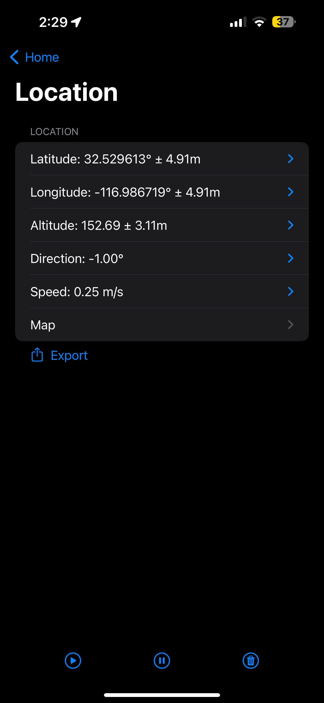
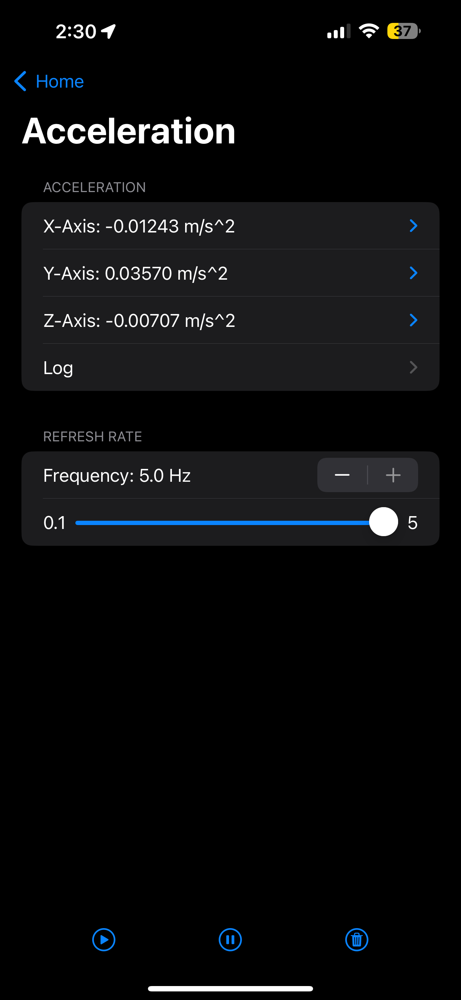

# Sensor-App
TABULADOR DETALLADO DE LOS SENSORES DE FABRICA DEL TELEFONO, via FIGMA.com (FigmaJAM) o  MARKDOWN

## Location
| Caracteristicas |        Valores        |
|-----------------|-----------------------|
| Latitude        |   32.529613°± 4.91m   |
| Longitude       | -116.986719°± 4.91m   |
| Altitude        |       152.69± 3.11m   |
| Direction       |              -1.00°   |
| Speed           |            0.25 m/s   |
| Map             |    |

## Acceleration

| Caracteristicas  |        Valores       |
|------------------|----------------------|
| X-Axis:          |     -0.01243 m/s^2   |
| Y-Axis:          |      0.03570 m/s^2   |
| Z-Axis:          |     -0.00707 m/s^2   |
| Log              |    |

## Gravity

| Caracteristicas  |            Valores          |
|------------------|-----------------------------|
| X-Axis:          |     0.00204 g (9,81m/s^2)   |
| Y-Axis:          |     -0.87332 g (9,81m/s^2)  |
| Z-Axis:          |     -0.48714 g (9,81 m/s^2) |
| Log              |    |

## Gyroscope

| Caracteristicas  |        Valores       |
|------------------|----------------------|
| X-Axis:          |      0.62795 rad/s   |
| Y-Axis:          |      0.04451 rad/s   |
| Z-Axis:          |     -0.56210 rad/s   |
| Log              |    |

## Magnetometer

| Caracteristicas  |        Valores       |
|------------------|----------------------|
| X-Axis:          |      -22.20322 µT    |
| Y-Axis:          |      -20.47510 µT    |
| Z-Axis:          |      -22.02454 µT    |
| Log              |    |

## Attitude
| Caracteristicas  |        Valores       |
|------------------|----------------------|
| Roll:            |     -90.44232°   |
| Pitch:           |      80.82929°   |
| Yaw:             |     -109.97343°   |
| Heading:         |     101.23970°   |
| Log              |    |

## Altitude

| Caracteristicas     |        Valores       |
|---------------------|----------------------|
| Pressure:           |         99.82732kPa  |
| Altitude change:    |         -0.12155 m   |
| Log                 |                      |
